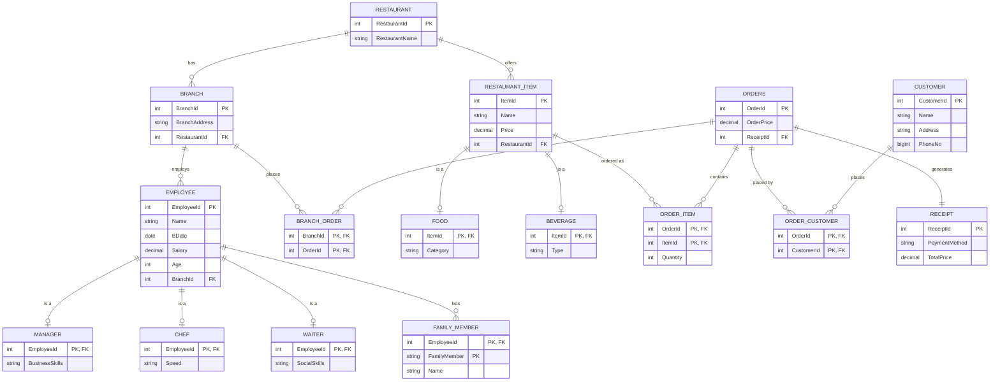

# RestaurantDB

A relational database for a multi-brand restaurant chain: restaurants with
multiple branches, staff with role-specific attributes, a menu split into
food and beverages, and an order pipeline that ties customers, branches,
line items and receipts together.

Built for Microsoft SQL Server (T-SQL), designed around a normalized schema
with `ISA` (supertype/subtype) hierarchies for employees and menu items.

## Contents

- [Entity-Relationship Diagram](#entity-relationship-diagram)
- [Schema Overview](#schema-overview)
- [Project Structure](#project-structure)
- [Getting Started](#getting-started)
- [Sample Queries](#sample-queries)
- [Design Notes](#design-notes)

## Entity-Relationship Diagram



The original Visio source (`.vsdx`) and the exported PDF are kept under
[`docs/legacy/`](docs/legacy/) for reference.

## Schema Overview

| Table              | Purpose                                                            |
|---------------------|---------------------------------------------------------------------|
| `Restaurant`         | A restaurant brand (e.g. a chain name).                            |
| `Branch`             | A physical location belonging to a restaurant.                     |
| `Employee`           | Base attributes shared by every staff member.                      |
| `Manager` / `Chef` / `Waiter` | Role-specific attributes; one row per `Employee` sub-type. |
| `FamilyMember`       | Emergency-contact / family info tied to an employee.                |
| `Customer`           | People who place orders.                                           |
| `RestaurantItem`     | Base attributes shared by every menu item.                         |
| `Food` / `Beverage`  | Category-specific attributes for menu items.                       |
| `Receipt`            | Payment method and total for a transaction.                        |
| `Orders`             | An order and the receipt it settled against.                       |
| `OrderItem`          | Line items: which menu items (and how many) were in an order.      |
| `BranchOrder`        | Which branch fulfilled an order.                                   |
| `OrderCustomer`      | Which customer(s) placed an order.                                 |

## Project Structure

```
RestaurantDatabase/
├── sql/
│   ├── 01_create_database.sql   # Database creation
│   ├── 02_schema.sql            # Tables, keys, constraints, indexes
│   ├── 03_seed_data.sql         # Sample data
│   ├── 04_views.sql             # Reporting views
│   ├── 05_procedures.sql        # Stored procedures
│   └── 06_sample_queries.sql    # Example analytical queries
├── docs/
│   └── legacy/                  # Original ER diagram (.vsdx), PDF export,
│                                 # and the raw SSMS-generated script
├── .gitignore
├── LICENSE
└── README.md
```

## Getting Started

Requires SQL Server 2019+ (or Azure SQL) and either SSMS or `sqlcmd`.

Run the scripts in order:

```powershell
sqlcmd -S localhost -i sql\01_create_database.sql
sqlcmd -S localhost -i sql\02_schema.sql
sqlcmd -S localhost -i sql\03_seed_data.sql
sqlcmd -S localhost -i sql\04_views.sql
sqlcmd -S localhost -i sql\05_procedures.sql
```

Then explore with:

```powershell
sqlcmd -S localhost -d RestaurantDB -i sql\06_sample_queries.sql
```

## Sample Queries

A few things you can ask the database once it's loaded (see
[`sql/06_sample_queries.sql`](sql/06_sample_queries.sql) for the full list):

- Revenue and order count per restaurant chain
- Top-selling menu items by quantity (`dbo.usp_GetTopSellingItems`)
- Average salary by employee role
- Customers ranked by total spend
- Menu items that have never been ordered
- Full order history for a given customer (`dbo.usp_GetCustomerOrderHistory`)

## Design Notes

This schema evolved from an earlier coursework version. Notable changes:

- **Added `OrderItem`.** The original model recorded an order's total price
  but never which menu items were actually in it. `OrderItem` (`OrderId`,
  `ItemId`, `Quantity`) closes that gap and is what makes "best-selling item"
  or "order contents" queries possible.
- **Added missing foreign keys on `OrderCustomer`.** It previously had no
  referential integrity to `Orders` or `Customer` at all, and the sample data
  referenced customer IDs that didn't exist. Both are fixed.
- **Indexed every foreign key** that wasn't already covered by a primary key,
  and added `CHECK` constraints on prices/quantities that were missing them.
- **ISA hierarchies** (`Employee` → `Manager`/`Chef`/`Waiter`, `RestaurantItem`
  → `Food`/`Beverage`) are modeled as one-to-one sub-type tables sharing the
  parent's primary key and cascading on delete, exposed through
  `vw_EmployeeDirectory` and `vw_MenuItem` so callers don't need to know the
  underlying hierarchy.
